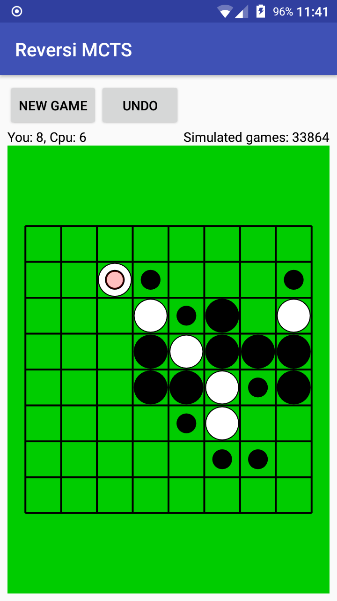

# Reversi-MCTS-Android
Reversi (also known as Othello) AI using MCTS (Monte Carlo Tree Search) for Android

## Monte Carlo Tree Search
- constant for exploration is 0.5 instead of sqrt(2)
- simulations are biased, as choosing corner move is 3x more likely than other move
- parallel implemented as root parallel (independed tree for each thread)
- RandomXS128 taken directly from libgdx, enough for few-threads random simulations

## Reversi
- implemented as bitboard, on Xiaomi Redmi 3S generates about 7500 games per thread per second, from the beginning

The code for bitboard and cpu/mcts are written in pure java so they can be taken freely and used elsewhere, not only android. The android code is partly written in kotlin.

The AI strength tested against KDE's kreversi. A 1 second 4 threads (or ~30000 games from the beginning) often beats the "very hard" of kreversi and sometimes the "extremely hard". It's neat considering almost no heuristics typical to Reversi is written.
